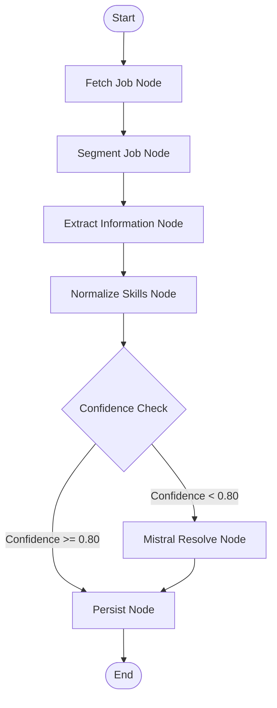
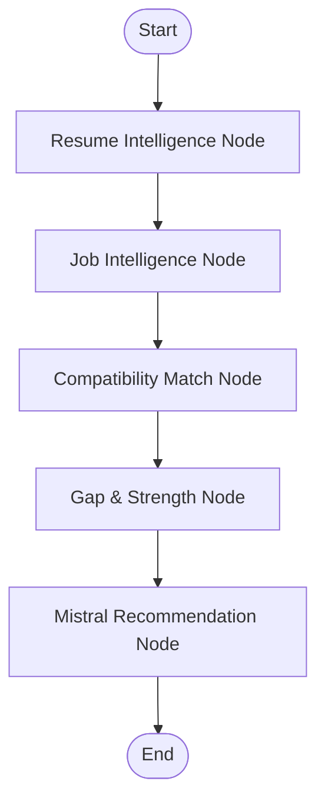

# Job Intelligence + Resume Intelligence + Compatibility Analysis Platform

[](https://www.python.org/)
[](https://fastapi.tiangolo.com/)
[](https://github.com/langchain-ai/langgraph)
[](https://mistral.ai/)
[](https://www.postgresql.org/)
[](https://www.docker.com/)
[](LICENSE)

> Transform unstructured Job Descriptions and Resumes into structured intelligence, analyze candidate compatibility, optimize ATS parameters, and generate personalized recommendations using deterministic NLP, LangGraph orchestration, ESCO Taxonomy normalization, and Mistral AI reasoning.

---

## 2. Overview

### What is the Platform?
The **Job Intelligence + Resume Intelligence + Compatibility Analysis Platform** is an enterprise-grade, domain-driven AI-orchestrated talent acquisition engine. The system is designed to ingest unstructured job descriptions (JDs) and resumes, parse them with deterministic accuracy, standardize extracted skills against the European Skills, Competences, Qualifications and Occupations (ESCO) taxonomy, and perform dual-profile compatibility mapping.

### Why Was It Built?
Modern recruitment processes suffer from fragmented data. Job postings are posted across greenhouse, lever, and indeed with inconsistent naming, while resumes are formatted in highly creative, non-standard structures. This lack of standardization makes accurate matchmaking, skill gap identification, and applicant tracking extremely difficult.

This platform bridges the gap by translating raw, unstructured input text or PDFs into highly structured, ESCO-standardized talent data profiles, and mathematically computing compatibility metrics while utilizing LLM reasoning as an analytical advisor rather than a black-box extractor.

### Target Users
* **Talent Acquisition & Recruiters:** Instantly rank resumes against any job specification with detailed gap and strength analysis.
* **Talent Intelligence Teams:** Enforce standardized taxonomy compliance across thousands of job profiles.
* **HR Tech Integrators:** Leverage Model Context Protocol (MCP) and structured APIs to embed resume and job intelligence into existing ATS platforms.
* **Job Seekers:** Optimize resumes for specific target jobs, identify missing critical keywords, and receive tailored resume refinement recommendations.

---

## 3. Key Features

| Feature Area | Sub-Feature | Key Tech / Methods |
| :--- | :--- | :--- |
| **Job Intelligence** | Ingestion from raw text, web URLs, or PDF pathways. Clean noise, segment, and extract structured JDs. | `BeautifulSoup4`, `PyPDF2`, DeBERTa-v3, Exact/Fuzzy matching, ESCO taxonomy mapping |
| **Resume Intelligence** | Full section layout detection, skill extraction, experience history, education history, and credential extraction. | Layout-aware PDF parsers, regex heuristics, ESCO skill normalization |
| **Compatibility Engine** | Mathematical matching across skills, experience, education, projects, and certifications. Computes structured compatibility score. | Vector space cosine similarity, weighted criteria calculations |
| **ATS Optimization** | Computes keyword coverage, highlights missing high-priority skills, and generates exact resume tuning suggestions. | Deterministic overlap analysis, Mistral AI advisor |
| **Recommendation Engine** | Actionable improvement tasks, experience description enhancement, and project description recommendations. | Mistral Small Latest reasoning, structured JSON schemas |
| **LangGraph Orchestration** | Manages pipeline state, controls conditional nodes, routes reviews, and coordinates multi-node workflows. | `LangGraph`, `StateGraph` |
| **Human-in-the-Loop Review** | Automatically escalates low-confidence taxonomy mappings to a review queue for human/Mistral correction. | FastAPI endpoint routing, Audit Logging |
| **Mistral AI Reasoning** | Resolves taxonomy ambiguities, generates recommendations, and reason over low-confidence entities. | Mistral Small API Integration |
| **MCP Integration** | Standardizes service wrappers under the Model Context Protocol to allow external agentic consumption. | BaseMCPTool, ToolRegistry |

---

## 4. System Architecture

The platform architecture is built around a unidirectional data flow starting at the user-facing web dashboard down to the database persistence layer, orchestrated via state graphs.

```text
       ┌─────────────────────────────────────────────────────────┐
       │                Next.js Frontend Client                  │
       │         (Zustand, Tailwind, Framer Motion)              │
       └────────────────────────────┬────────────────────────────┘
                                    │ HTTP / JSON API
                                    ▼
       ┌─────────────────────────────────────────────────────────┐
       │                FastAPI Application Layer                │
       │     (Endpoints, Lifespan, Logging/Metrics Middleware)   │
       └────────────────────────────┬────────────────────────────┘
                                    │ Instantiates
                                    ▼
       ┌─────────────────────────────────────────────────────────┐
       │             LangGraph Orchestration Layer               │
       │     (Coordinates Nodes, Edges, and Pipeline State)      │
       └────────────────────────────┬────────────────────────────┘
                                    │ Controls Flow
                                    ▼
       ┌─────────────────────────────────────────────────────────┐
       │       Job / Resume / Compatibility Engine Pipelines     │
       │  ┌─────────────────────────┐   ┌─────────────────────┐  │
       │  │ Job Intelligence Pipe   │ ──>│ Resume Intel Pipe   │  │
       │  └────────────┬────────────┘   └──────────┬──────────┘  │
       │               │                           │
       │               ▼                           ▼
       │  ┌─────────────────────────┐   ┌─────────────────────┐  │
       │  │  Compatibility Engine   │ ──>│  Recs / ATS Engine  │  │
       │  └────────────┬────────────┘   └──────────┬──────────┘  │
       │               │                           │
       │               └────────────┬──────────────┘
       │                            ▼
       │                ┌───────────────────────┐
       │                │   Mistral AI Advisor  │
       │                └───────────────────────┘
       └────────────────────────────┬────────────────────────────┘
                                    │
                                    ▼
       ┌─────────────────────────────────────────────────────────┐
       │              Persistence & Repository Layer              │
       │    (SQLAlchemy 2.0 Async Session, PostgreSQL Database)  │
       └─────────────────────────────────────────────────────────┘
```

### Component Details
1. **Frontend Client:** Offers dashboards for Job Analysis, Resume Analysis, Compatibility, and ATS Recommendations.
2. **FastAPI Application Layer:** Provides secure endpoints for job URL parsing, PDF upload parsing, compatibility calculations, and recommendation generation.
3. **LangGraph Orchestration:** Controls processing state machines, tracks step executions, and routes low-confidence extractions.
4. **Ingestion & Processing Pipelines:** Modular subsystems that clean boilerplate text, segment paragraphs, isolate raw entities, and normalize names using ESCO.
5. **Compatibility & Recommendation Engines:** Evaluate job specifications against candidate profiles to score overlap and construct actionable optimization plans.
6. **Mistral AI Resolver:** Serves as a reasoning advisor for out-of-taxonomy terms, ambiguous keyword resolution, and narrative suggestions.
7. **Persistence Layer:** Stores processed jobs, resumes, compatibility reports, execution audits, and review queue records.

---

## 5. System Workflows

### 5.1 Job Description Ingestion Workflow
```text
Job URL / Job PDF
        │
        ▼
    Ingestion ──────> Downloads and extracts raw text/HTML.
        │
        ▼
 Noise Filtering ───> Strips legal notices, headers, and footer blocks.
        │
        ▼
  Segmentation ─────> Partitions text (Requirements, Responsibilities, etc.).
        │
        ▼
   Extraction ──────> Parses raw skill strings, experience limits, and seniority.
        │
        ▼
  Normalization ────> Queries ESCO taxonomy (Exact, Fuzzy, Embeddings).
        │
        ▼
Review Evaluation ──> Checks matching confidence scores.
        ├── Confidence >= 0.8 ──> Persist
        └── Confidence < 0.8  ──> Route to Mistral / Review Queue
        │
        ▼
Job Intelligence Report
```

### 5.2 Resume Processing Workflow
```text
Resume PDF
        │
        ▼
 Resume Ingestion ──> Extracts raw text retaining line/layout structure.
        │
        ▼
   Segmentation ────> Identifies sections (Education, Experience, Skills, Projects).
        │
        ▼
   Extraction ──────> Detects academic degrees, job titles, date ranges, and skills.
        │
        ▼
  Normalization ────> Standardizes resume skills against ESCO database.
        │
        ▼
Resume Intelligence Report
```

### 5.3 Compatibility & Recommendation Workflow
```text
Job Intelligence  +  Resume Intelligence
        │                   │
        └─────────┬─────────┘
                  ▼
        Compatibility Engine
                  │
        ┌─────────┴─────────┐
        ▼                   ▼
   Gap Analysis      Strength Analysis
        │                   │
        └─────────┬─────────┘
                  ▼
     Mistral Recommendation Engine
                  │
        ┌─────────┴─────────┐
        ▼                   ▼
ATS Optimization    Resume Improvement
  Suggestions          Suggestions
        │                   │
        └─────────┬─────────┘
                  ▼
     Application Readiness Score
```

---

## 6. NLP Pipelines

### Job Pipeline
* **Ingestion:** Downloads job web pages using layout-aware scrapers (stripping boilerplate) or parses PDF files while maintaining layout flow.
* **Noise Filtering:** Applies heuristic filters to strip EOE declarations, office perks, and application advice.
* **Segmentation:** Groups text blocks into logical sections (`Requirements`, `Responsibilities`, `Overview`).
* **Skill Extraction:** Pulls raw skill noun phrases using custom syntactic parsing.
* **Experience Extraction:** Identifies minimum and maximum experience year ranges (e.g., "5-8 years" maps to min `5.0` and max `8.0`).
* **Seniority Detection:** Labels role level (`Junior`, `Mid`, `Senior`, `Lead`, `Executive`).
* **Requirement Classification:** Classifies skills into `must_have`, `preferred`, and `optional`.
* **ESCO Normalization:** Normalizes raw skill terms into URI-linked ESCO definitions.

### Resume Pipeline
* **Resume Ingestion:** Reads uploaded PDFs, maintaining visual order.
* **Section Detection:** Segment sections such as `Work Experience`, `Education`, `Skills`, `Projects`, and `Certifications`.
* **Skill Extraction:** Gathers technical terms and methodologies.
* **Experience Extraction:** Captures job titles, employers, dates, and experience length.
* **Education Extraction:** Extracts degrees (e.g., BS, MS, PhD), institutions, majors, and graduation years.
* **Normalization:** Translates candidate skills into ESCO codes to enable direct matching.

### Compatibility Pipeline
* **Skill Matching:** Determines semantic and exact overlaps between job requirements and resume skills.
* **Experience Matching:** Compares candidate years of experience and seniority against the job baseline.
* **Education Matching:** Evaluates degree levels and field of study alignment.
* **Project Matching:** Assesses relevance of candidate project descriptions against the job responsibilities.
* **Certification Matching:** Matches candidate credentials against required certifications.

### Recommendation Pipeline
* **Mistral Recommendation Engine:** Compares the structured reports to produce narrative enhancements.
* **ATS Optimization:** Identifies specific missing key phrases and recommends insertion strategies.
* **Resume Improvement Suggestions:** Outlines actionable enhancements for bullet points, projects, and skills.

---

## 7. LangGraph Orchestration

LangGraph manages pipeline workflows via stateful graphs, enabling recovery routines, evaluations, and human-in-the-loop interventions.

### 7.1 Job Intelligence Graph


### 7.2 Compatibility & Recommendation Graph


### LangGraph Pipeline State Example
```python
from typing import TypedDict, List, Dict, Any

class PipelineState(TypedDict):
    source_url: str | None
    pdf_path: str | None
    raw_document: str | None
    cleaned_document: str | None
    sections: Dict[str, str]
    raw_skills: List[str]
    extracted_metadata: Dict[str, Any]
    normalized_skills: List[Dict[str, Any]]
    review_required: bool
    review_queue_id: str | None
    errors: List[str]
```

---

## 8. ESCO Skill Normalization

Skill normalization implements a multi-tiered fallback architecture to maximize matching accuracy:

```text
Raw Skill String: "Expert Javascript Developer"
       │
       ▼
 ┌───────────┐      Yes      ┌──────────────────────┐
 │Exact Match│ ────────────> │ Assign ESCO Code     │ (Confidence: 1.0)
 └─────┬─────┘               └──────────────────────┘
       │ No
       ▼
 ┌───────────┐      Yes      ┌──────────────────────┐
 │Fuzzy Match│ ────────────> │ Compute Levenshtein  │ (Confidence: 0.8 - 0.95)
 └─────┬─────┘               └──────────────────────┘
       │ No
       ▼
 ┌───────────┐      Yes      ┌──────────────────────┐
 │Embedding  │ ────────────> │ Cosine Similarity    │ (Confidence: 0.6 - 0.8)
 │Similarity │               └──────────────────────┘
 └─────┬─────┘
       │ No (Confidence < 0.6)
       ▼
 ┌──────────────────────────────────────────────────┐
 │ Escalate to Review Queue / Mistral Reasoning     │ (Confidence: Dynamic)
 └──────────────────────────────────────────────────┘
```

---

## 9. Mistral AI Integration

Mistral AI (using `mistral-small-latest`) acts as a structured reasoning advisor rather than a generative black-box parser. This keeps processing deterministic while providing high-quality analysis.

* **Ambiguous Skill Resolution:** Disambiguates contextual terms (e.g., distinguishing "Go" the language from general verbs) based on surrounding keywords.
* **Low-Confidence Recovery:** Reviews elements tagged with low matching confidence to correct or suggest alternative ESCO taxonomy mappings.
* **Gap Analysis & Recommendations:** Compares parsed structures to generate precise recommendations, avoiding hallucinated credentials.
* **ATS Keyword Tuning:** Identifies semantic keyword gaps and suggests natural phrases to insert into resumes.

---

## 10. Model Context Protocol (MCP) Integration

The project exposes a Model Context Protocol (MCP) binding, enabling external LLM agents to execute core tools locally or in production pipelines.

The codebase includes:
* **`BaseMCPTool`:** Base contract establishing schema representation and execution parameters.
* **`MCPToolRegistry`:** Handles tool discovery, automatic JSON schema generation, and routing.

Exposed Tools:
1. **`fetch_jd`**: Ingests, strips noise, and cleans job posting contents from URL or PDF paths.
2. **`run_ner`**: Extracts skill candidates, years of experience, and target seniorities.
3. **`lookup_taxonomy`**: Normalizes extracted skill terms against the ESCO standard.
4. **`save_parsed_jd`**: Saves parsed job data and ESCO mappings to the database.

---

## 11. Folder Structure

```text
JD Parser/
├── alembic/                    # Database migrations (Alembic)
├── app/                        # Application core source code
│   ├── api/                    # FastAPI routers and controller endpoints
│   │   └── v1/                 # API Version 1 Routers
│   ├── compatibility/          # Job ↔ Resume Compatibility Engine
│   │   ├── scoring/            # Scoring and weighting logic
│   │   ├── services/           # Compatibility orchestrators
│   │   └── schemas/            # Compatibility Pydantic response models
│   ├── config/                 # Pydantic Settings & Environment loading
│   ├── database/               # PostgreSQL engine, session, and ORM bases
│   ├── extraction/             # Deterministic NER and heuristic extraction
│   ├── ingestion/              # PDF and HTTP web content retrieval
│   ├── logging/                # Structured JSON logging configuration
│   ├── models/                 # SQLAlchemy Database models (Job, Skill, ProcessingRun)
│   ├── normalization/          # ESCO matching logic (Exact, Fuzzy, Embeddings)
│   ├── orchestration/          # LangGraph state configurations and workflow nodes
│   │   └── mcp/                # Model Context Protocol tools and registries
│   ├── preprocessing/          # Noise purification and paragraph segmentation
│   ├── presentation/           # Response builders and presentation models
│   ├── recommendations/        # Resume recommendation and ATS optimization engines
│   │   ├── services/           # Recommendation builders
│   │   └── schemas/            # Recommendations Pydantic schemas
│   ├── repositories/           # Database CRUD abstraction layers
│   ├── resume/                 # Resume Ingestion, parsing, and normalization
│   │   ├── services/           # Resume parser implementations
│   │   └── schemas/            # Resume Intelligence models
│   ├── review/                 # Human-in-the-loop review queues
│   └── main.py                 # FastAPI application factory
├── frontend/                   # Next.js 15 app
│   ├── src/                    # Frontend source (React, Zustand, Framer Motion)
│   │   ├── components/         # Shared dashboard UI widgets
│   │   ├── store/              # Zustand global state management
│   │   └── app/                # Next.js Page components (Job, Resume, Compatibility)
│   └── package.json            # Frontend dependency specifications
├── tests/                      # Pytest unit, integration, and E2E runs
├── docker-compose.yml          # Production/Local Compose Orchestration
├── Dockerfile                  # Production API container manifest
├── pyproject.toml              # Ruff, MyPy, and tool configs
└── restart_system.ps1          # System restart and environment runner script
```

---

## 12. New Feature Modules

### 12.1 Resume ↔ Job Compatibility Analysis
Performs detailed compatibility scoring between any resume and a parsed job.

* **Overall Compatibility Score (0-100%):** Weighted aggregate of skill match (40%), experience match (30%), education match (15%), and contextual relevance (15%).
* **Gap Analysis:** Identifies missing required skills, experience level differences, and education discrepancies.
* **Strength Analysis:** Highlights matched skills, exceed-expectations points, and credential matches.

#### Example Output Payload
```json
{
  "compatibility_score": 82.5,
  "match_analysis": {
    "skills_match": 85.0,
    "experience_match": 80.0,
    "education_match": 100.0,
    "contextual_match": 75.0
  },
  "gap_analysis": {
    "missing_mandatory_skills": ["Kubernetes", "TypeScript"],
    "missing_preferred_skills": ["Next.js"],
    "experience_gap_years": 0.0,
    "education_gap": null
  },
  "strength_analysis": {
    "matched_mandatory_skills": ["Python", "FastAPI", "PostgreSQL"],
    "matched_preferred_skills": ["Docker", "Tailwind CSS"],
    "experience_status": "Matches requirement exactly"
  },
  "application_readiness_score": 85.0
}
```

### 12.2 ATS Optimization Engine
Helps candidates tailor their resume text to fit parsing criteria.
* **Keyword Coverage:** Compares resume vocabulary with job keyword frequencies.
* **Missing Keywords:** Lists exact terms found in the job requirements but missing from the resume.
* **Resume Tuning Suggestions:** Generates specific bullet-point rewrites to naturally integrate missing skills.

### 12.3 Resume Recommendation Engine
Provides structured suggestions to enhance the resume.
* **Resume Improvement Suggestions:** Step-by-step suggestions focusing on bullet-point impact.
* **Project Recommendations:** Recommends specific project ideas to address skill gaps.
* **Skill Highlighting:** Identifies which existing skills to emphasize based on the job requirements.

---

## 13. API Reference

### Job Analysis
* **`POST /api/v1/pipeline/run/url`**
  * Parses a job web URL and runs the full LangGraph pipeline.
* **`POST /api/v1/pipeline/run/pdf`**
  * Runs the pipeline on a local PDF file path.
* **`POST /api/v1/pipeline/run/upload`**
  * Uploads a job PDF from the browser and executes the pipeline.

### Resume Analysis
* **`POST /api/v1/resume/analyze`**
  * Uploads and parses a resume PDF, returning a candidate intelligence report.

### Compatibility Analysis
* **`POST /api/v1/compatibility/analyze`**
  * Compares parsed Resume and Job Intelligence reports directly.
* **`POST /api/v1/compatibility/analyze-pdf`**
  * Compares an uploaded resume PDF against a database Job ID or uploaded Job PDF.
* **`POST /api/v1/compatibility/analyze-url`**
  * Compares an uploaded resume PDF against a Job URL.

### Recommendations
* **`POST /api/v1/resume/recommendations`**
  * Generates ATS optimizations and resume improvement suggestions.

### Utilities
* **`GET /api/v1/health/live`**
  * Liveness probe.
* **`GET /api/v1/health/ready`**
  * Readiness probe checking DB connection status.
* **`GET /api/v1/pipeline/debug/{job_id}`**
  * Retrieves the full internal state data of a job run.

---

## 14. Frontend Application

The user interface is built as a single-page dashboard with responsive sub-views.

### Pages & Sub-Views
* **Dashboard Home:** System stats, recent runs, and overall match metrics.
* **Job Analyzer:** Input job URLs or upload PDFs to view extracted skills and segments.
* **Resume Analyzer:** Upload resume PDFs to extract education, experience, and normalized skills.
* **Compatibility Dashboard:** Renders matching matrices, radar charts, gap alerts, and overall scores.
* **ATS Recommendation Panel:** Highlights keyword improvements and copy-pasteable bullet updates.
* **Human Review Center:** Panel for editing and confirming low-confidence taxonomy matches.

### Technology Stack
* **Framework:** Next.js 15 (App Router) & React 19
* **Styling & Animations:** Tailwind CSS & Framer Motion
* **State Management:** Zustand
* **Data Fetching:** TanStack Query (React Query)

---

## 15. Local Development Setup

### Prerequisites
* Python 3.11+
* Node.js 20+
* PostgreSQL 16+

### Backend Setup
1. Clone the repository and navigate to the root directory.
2. Initialize a Python virtual environment:
   ```powershell
   python -m venv .venv
   .venv\Scripts\Activate.ps1
   pip install -r requirements.txt
   ```
3. Copy/configure environment variables in `.env`:
   ```ini
   DB_HOST=localhost
   DB_PORT=5432
   DB_NAME=jd_parser
   DB_USER=postgres
   DB_PASSWORD=postgres
   MISTRAL_API_KEY=your_key_here
   ```
4. Run migrations:
   ```powershell
   alembic upgrade head
   ```
5. Start the API server:
   ```powershell
   uvicorn app.main:app --reload --port 8000
   ```

### Frontend Setup
1. Navigate to the frontend directory:
   ```powershell
   cd frontend
   npm install
   ```
2. Start the development server:
   ```powershell
   npm run dev
   ```

---

## 16. Docker Setup

Deploy the backend API, Postgres database, and Next.js frontend with Docker Compose:

```powershell
# Build and run containers
docker compose up --build

# Run database migrations in container context
docker compose exec backend alembic upgrade head

# Stop services
docker compose down
```

---

## 17. Testing Strategy

Run the test suite using Pytest to verify system reliability:

```powershell
# Run unit tests
pytest tests/unit

# Run E2E integration tests
pytest tests/integration

# Check coverage report
pytest --cov=app tests/
```

---

## 18. Project Documentation

Refer to internal files in `docs/` or the root folder for detailed specs:
* [walkthrough.md](walkthrough.md) — Step-by-step code and component walk-through.
* [architecture.md](architecture.md) — Detailed architecture schemas and database definitions.
* [implementation_plan.md](implementation_plan.md) — Phased progress tracking.
* [tasks.md](tasks.md) — Actionable task board.
* [CHANGELOG.md](CHANGELOG.md) — Release notes.
* [intent_matrix_results.md](intent_matrix_results.md) — Extraction intent matrix test logs.

---

## 19. Roadmap

### Completed Features
- [x] **Job Intelligence Pipeline:** Automated URL/PDF parsing and segmentation.
- [x] **Resume Intelligence Engine:** Resume parsing, section classification, and skill parsing.
- [x] **Compatibility Engine:** Weighted criteria scoring, gap analysis, and strength mapping.
- [x] **LangGraph Orchestrator:** Stateful processing flow.
- [x] **Human-in-the-Loop Review Dashboard:** Web interface to edit skill mappings.
- [x] **Mistral AI Integration:** Multi-stage context evaluation and recommendation generation.

### Future Roadmap
- [ ] **Candidate Ranking:** Bulk resume uploads ranked against target job profiles.
- [ ] **Multi-Resume Comparison:** Side-by-side match dashboards.
- [ ] **Interview Readiness Analysis:** Automated preparation questions based on gap analysis.
- [ ] **Skill Trend Analytics:** Real-time dashboards showing fast-growing requirements.
- [ ] **Multi-Language Support:** Taxonomy mappings in French, German, and Spanish.
- [ ] **Cloud Deployment:** Production Docker Compose and Terraform manifests.

---

## 20. Screenshots

* **Job Analysis Dashboard:** `docs/screenshots/job_analysis.png`
* **Resume Analysis Dashboard:** `docs/screenshots/resume_analysis.png`
* **Compatibility Dashboard:** `docs/screenshots/compatibility.png`
* **ATS Recommendation Dashboard:** `docs/screenshots/ats_recommendations.png`
* **LangGraph Visualization:** `docs/screenshots/pipeline_visualization.png`
* **Recommendation Engine:** `docs/screenshots/recommendations.png`

---

## 21. Acknowledgements

* **FastAPI** — High-performance web APIs.
* **LangGraph** — Multi-agent state orchestration.
* **ESCO Taxonomy** — Standardized skills taxonomy.
* **Mistral AI** — Advanced reasoning models.

---

## 22. License

This project is licensed under the MIT License - see the [LICENSE](LICENSE) file for details.
