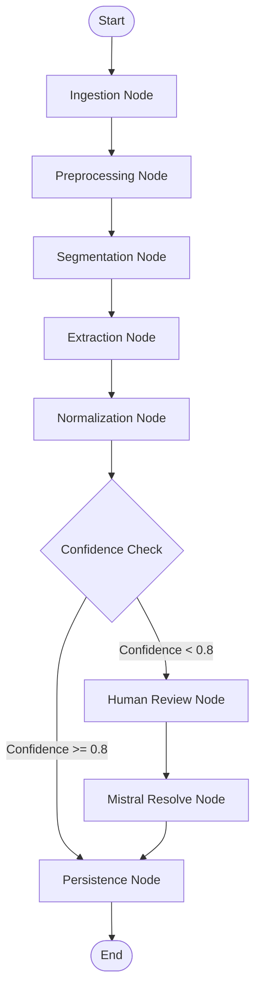
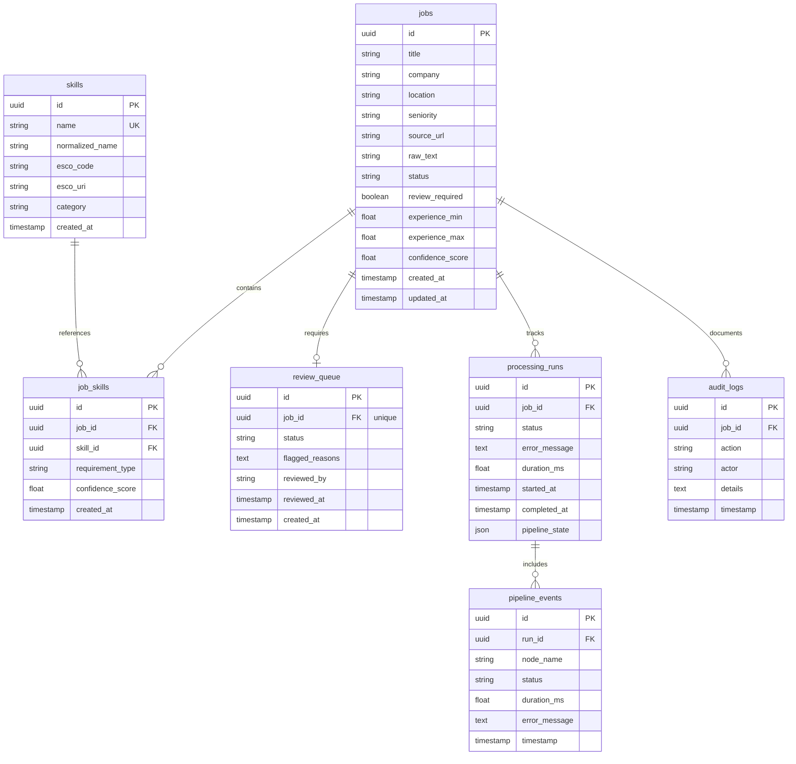

# JD Skill Intelligence Platform

[](https://www.python.org/)
[](https://fastapi.tiangolo.com/)
[](https://github.com/langchain-ai/langgraph)
[](https://mistral.ai/)
[](https://www.postgresql.org/)
[](https://www.docker.com/)
[](LICENSE)

> Transform Job Descriptions into Structured Skill Intelligence using NLP, LangGraph, ESCO Taxonomy, and Mistral AI.

---

## 2. Overview

### What is the JD Skill Intelligence Platform?
The JD Skill Intelligence Platform is an enterprise-grade, domain-driven AI parser and pipeline designed to ingest unstructured job descriptions (JDs) from diverse sources and extract structured skill profiles. It automatically normalizes extracted skills against the European Skills, Competences, Qualifications and Occupations (ESCO) taxonomy.

### Why Was It Built?
Modern recruitment processes suffer from fragmented job definitions. Recruiters and Talent Acquisition teams copy-paste text from various legacy systems or public pages (Greenhouse, Lever, Indeed, Naukri, or PDFs). This results in inconsistent hiring criteria, poor search capabilities, and a lack of standardized skill inventories.

The JD Skill Intelligence Platform addresses these issues by translating raw, noisy JDs into highly structured, standardized talent data profiles.

### Target Users
* Recruiters & Talent Acquisition Teams: Streamline standard sourcing criteria by extracting clear "must-have" vs "preferred" capabilities.
* Talent Intelligence Teams: Establish consistent taxonomies across thousands of job titles to analyze skill gaps.
* HR Teams & Hiring Managers: Standardize job specifications automatically during job posting creation.
* Job Seekers: Map job requirements against standardized profiles to understand specific qualifications.

---

## 3. Key Features

| Feature | Description | Key Tech / Methods |
| :--- | :--- | :--- |
| **Multi-Source Ingestion** | Ingestion from raw text, web URLs (Naukri, Indeed, Lever, Greenhouse, etc.), or local/uploaded PDF files. | `BeautifulSoup4`, `PyPDF2`, `FastAPI UploadFile` |
| **Advanced Preprocessing** | Cleans HTML boilerplates, structural noise, and irrelevant legal disclosures. | Regular expressions, heuristic noise filters |
| **Deep Segmentation** | Segments JDs into structural sections like Requirements, Responsibilities, and Benefits. | DeBERTa-v3 / Tokenizer-driven Classification |
| **Entity Extraction** | Extracts skill entities, minimum and maximum experience levels, and target seniorities. | Named Entity Recognition (NER), Custom NLP rules |
| **ESCO Normalization** | Matches raw skills to the ESCO taxonomy using a tiered confidence strategy. | Exact, Fuzzy matching, and Text Embeddings |
| **LangGraph Orchestration** | Manages pipeline state, handles conditional routing, and tracks execution history. | `LangGraph`, `StateGraph` |
| **Human-in-the-Loop Review** | Automatically routes low-confidence extractions to a web-based human review queue. | FastAPI endpoint routing, Audit Logging |
| **Mistral AI Reasoning** | Resolves ambiguous mappings, handles out-of-taxonomy terms, and aids low-confidence review. | Mistral Small API Integration |
| **MCP Integration** | Standardizes service wrappers under the Model Context Protocol to allow external agentic consumption. | BaseMCPTool, ToolRegistry |
| **Audit Trails & Runs** | Logs step-by-step pipeline durations, outcomes, and revisions for full observability. | PostgreSQL, SQLAlchemy, JSON state snapshots |

---

## 4. System Architecture

The JD Skill Intelligence Platform is built using a layered, modular, domain-driven architecture that separates ingestion, processing, normalization, human review, and persistence.

```text
       ┌─────────────────────────────────────────────────────────┐
       │                       Web Clients                       │
       └────────────────────────────┬────────────────────────────┘
                                    │ HTTP / JSON API
                                    ▼
       ┌─────────────────────────────────────────────────────────┐
       │                FastAPI Application Layer                │
       │     (Endpoints, Lifespan, Logging/Metrics Middleware)   │
       └────────────────────────────┬────────────────────────────┘
                                    │ Instantiates
                                    ▼
       ┌─────────────────────────────────────────────────────────┐
       │             LangGraph Orchestration Layer               │
       │     (Coordinates Nodes, Edges, and Pipeline State)      │
       └────────────────────────────┬────────────────────────────┘
                                    │ Controls Execution Flow
                                    ▼
       ┌─────────────────────────────────────────────────────────┐
       │                     NLP Pipeline                        │
       │  ┌─────────────────────────┐   ┌─────────────────────┐  │
       │  │ Ingestion & Filtering   │ ──>│ Section Segmenter   │  │
       │  └─────────────────────────┘   └──────────┬──────────┘  │
       │  ┌─────────────────────────┐   ┌──────────▼──────────┐  │
       │  │ ESCO Skill Normalizer   │ <─│ NER Skill Extractor │  │
       │  └────────────┬────────────┘   └─────────────────────┘  │
       │               │
       │               ▼
       │  ┌─────────────────────────┐   ┌─────────────────────┐  │
       │  │  Mistral AI Resolver   │ ──>│  Review Router      │  │
       │  └─────────────────────────┘   └─────────────────────┘  │
       └────────────────────────────┬────────────────────────────┘
                                    │
                                    ▼
       ┌─────────────────────────────────────────────────────────┐
       │              Persistence & Repository Layer              │
       │    (SQLAlchemy 2.0 Async Session, PostgreSQL Database)  │
       └─────────────────────────────────────────────────────────┘
```

### Component Details
1. FastAPI Layer: Acts as the primary entrance for client requests. Exposes ingestion routes, system monitoring, and the review administration API.
2. LangGraph Orchestration: Evaluates pipeline states, routes processing runs through various validation nodes, and saves state snapshots.
3. NLP Pipeline: Operates sequentially to strip boilerplate elements, classify relevant sections, pull required entities, and attempt standard taxonomy matching.
4. Persistence Layer: Stores job specifications, matched skills, historical event tracks, review actions, and execution audits.

---

## 5. End-to-End Workflow

The diagram below details the sequence of processing stages from raw ingestion through final database storage.

```text
 Job URL or PDF Upload
           │
           ▼
    ┌─────────────┐
    │  Ingestion  │ ──> Downloads and extracts raw text/HTML boilerplate.
    └──────┬──────┘
           │
           ▼
    ┌─────────────┐
    │ Preprocessing│ ──> Strips legal text, headers, and footer noise.
    └──────┬──────┘
           │
           ▼
    ┌─────────────┐
    │ Segmentation│ ──> Identifies core parts (Requirements, Responsibilities).
    └──────┬──────┘
           │
           ▼
    ┌─────────────┐
    │ Extraction  │ ──> Extracts skill strings, experience limits, and seniority.
    └──────┬──────┘
           │
           ▼
    ┌─────────────┐
    │Normalization│ ──> Queries ESCO dictionary via Exact, Fuzzy, and Embeddings.
    └──────┬──────┘
           │
           ▼
    ┌─────────────┐
    │ Evaluation  │ ──> Checks matching confidence scores.
    └──────┬──────┘
           │
           ├─────────────────────────┐
           │ Confidence >= Threshold  │ Confidence < Threshold
           ▼                         ▼
    ┌─────────────┐           ┌─────────────┐
    │ Auto-Approve│           │Review Queue │ ──> Escalates to Human / Mistral AI.
    └──────┬──────┘           └──────┬──────┘
           │                         │ Action taken
           └──────────┬──────────────┘
                      │
                      ▼
               ┌─────────────┐
               │ Persistence │ ──> Saves Structured Job Intelligence Report.
               └─────────────┘
```

---

## 6. NLP Pipeline

The pipeline implements an advanced, highly specialized NLP processing sequence:

### 1. Ingestion
Handles the raw inputs. URLs are parsed using customized BeautifulSoup configurations to extract target description containers, bypassing navigation headers and sidebar widgets. PDF files are parsed via custom layout-aware helpers that maintain paragraph boundaries.

### 2. Preprocessing & Noise Filtering
Applies rule-based heuristic filters to delete non-functional text such as:
* Standard Equal Opportunity Employer (EOE) statements.
* Company benefits or office location descriptions.
* Application instructions or submission guidelines.

### 3. Section Segmentation
Uses classification logic to group paragraphs into structured sections:
* `Requirements` (contains required experience, technical knowledge, certifications)
* `Responsibilities` (tasks, team roles, job functions)
* `Overview / Benefits` (company profile, insurance, perks)

### 4. Skill Extraction
Applies a combination of rule-based pattern matching (e.g., regex matching common technical formats) and semantic keyword extraction to isolate raw candidate skill strings.

### 5. Experience & Seniority Extraction
Extracts numeric ranges expressing required experience (e.g., "3 to 5 years" parses to `experience_min: 3.0`, `experience_max: 5.0`). Seniority keywords are mapped to standardized categories (`Junior`, `Mid`, `Senior`, `Lead`, `Executive`).

### 6. Requirement Classification
Classifies each extracted skill into:
* `must_have` (mandatory qualifications)
* `preferred` (nice-to-have assets)
* `optional` (general contextual skills)

---

## 7. LangGraph Orchestration

The platform relies on LangGraph to construct a state-driven, modular pipeline execution graph.

### Why LangGraph?
Traditional pipelines execute in a rigid linear fashion. LangGraph allows stateful node transitions, routing based on intermediate confidence levels, error recovery logic, and human-in-the-loop pauses.



### LangGraph State Schema
```python
from typing import TypedDict, List, Dict, Any

class PipelineState(TypedDict):
    source_url: str | None
    pdf_path: str | None
    raw_document: str | None
    cleaned_document: str | None
    sections: Dict[str, str]
    raw_skills: List[str]
    extracted_metadata: Dict[str, Any]
    normalized_skills: List[Dict[str, Any]]
    review_required: bool
    review_queue_id: str | None
    errors: List[str]
```

---

## 8. ESCO Skill Normalization

The normalization service is structured as a multi-layered fallback system to match extracted strings against the official ESCO (European Skills, Competences, Qualifications and Occupations) database:

```text
Raw Skill String: "Expert Javascript Developer"
       │
       ▼
 ┌───────────┐      Yes      ┌──────────────────────┐
 │Exact Match│ ────────────> │ Assign ESCO Code     │ (Confidence: 1.0)
 └─────┬─────┘               └──────────────────────┘
       │ No
       ▼
 ┌───────────┐      Yes      ┌──────────────────────┐
 │Fuzzy Match│ ────────────> │ Compute Levenshtein  │ (Confidence: 0.8 - 0.95)
 └─────┬─────┘               └──────────────────────┘
       │ No
       ▼
 ┌───────────┐      Yes      ┌──────────────────────┐
 │Embedding  │ ────────────> │ Cosine Similarity    │ (Confidence: 0.6 - 0.8)
 │Similarity │               └──────────────────────┘
 └─────┬─────┘
       │ No (Confidence < 0.6)
       ▼
 ┌──────────────────────────────────────────────────┐
 │ Escalate to Review Queue / Mistral Reasoning     │ (Confidence: Dynamic)
 └──────────────────────────────────────────────────┘
```

---

## 9. Mistral AI Integration

The system integrates Mistral Small Latest as a reasoning layer rather than a basic text generator.

### Core Roles of Mistral AI
1. Ambiguous Term Resolution: If a skill maps closely to two distinct ESCO concepts (e.g., "Python" as a programming language vs. "Python" as a genus of snake), Mistral evaluates the surrounding context to pick the correct code.
2. Taxonomy Expansion: For skills not explicitly present in ESCO, Mistral suggests the nearest logical parent node category.
3. Fallback Evaluation: Generates explanations and confidence corrections for items flagged for human review.

---

## 10. Model Context Protocol (MCP) Integration

The project provides built-in bindings for the Model Context Protocol (MCP), allowing external LLMs and client processes to interface with key services directly through JSON schema contracts.

The MCP codebase provides the following core components:
*   `BaseMCPTool`: Implements the abstract base class establishing runtime contracts.
*   `MCPToolRegistry`: Provides a registry class facilitating runtime tool declaration, schema construction, and dispatch mapping.

The system registers the following custom tools:
1.  **`fetch_jd`**: Fetches and cleans job descriptions from arbitrary URLs or PDF pathways.
2.  **`run_ner`**: Parses raw job blocks, extracting target entities (skills, experience, seniorities).
3.  **`lookup_taxonomy`**: Standardizes raw skill text against matching ESCO classifications.
4.  **`save_parsed_jd`**: Persists the compiled Job metadata and resolved skill maps into active SQL tables.

---

## 11. Review Workflow

If a pipeline execution produces skill matches with confidence scores below the required threshold, the job is routed to the human-in-the-loop review pipeline:

* Review Queue Entry: A database record is generated in the `review_queue` table containing flagged reasons and confidence levels.
* API Interactivity: Administrators can fetch pending items and submit approvals, rejections, or manual text corrections.
* Audit Logging: Every review action is stored in the `audit_logs` table, detailing who performed the adjustment and when, ensuring full traceability.

---

## 12. Folder Structure

```text
JD Parser/
├── alembic/                    # Database migration configurations
├── app/                        # Application core source code
│   ├── api/                    # FastAPI routers and endpoints
│   │   └── v1/                 # Version 1 API endpoints (health, pipeline, review)
│   ├── config/                 # Application settings and constants
│   ├── database/               # Database engine, base, and session providers
│   ├── extraction/             # NLP extraction logic and parsing tools
│   ├── ingestion/              # Ingestion utilities for PDF and URLs
│   ├── logging/                # Structured logging configurations
│   ├── models/                 # SQLAlchemy core models
│   ├── normalization/          # ESCO matching logic and embedding tools
│   ├── orchestration/          # LangGraph state configurations and workflow nodes
│   │   └── mcp/                # Model Context Protocol tools and registry
│   ├── preprocessing/          # Noise filtering and section classification
│   ├── presentation/           # API response builders and formatting models
│   ├── repositories/           # Database interaction abstraction layers
│   ├── review/                 # Human review service logic
│   └── main.py                 # FastAPI application factory
├── data/                       # Local data storage for testing and reference
├── docs/                       # Internal implementation plan and design docs
├── frontend/                   # Next.js frontend code
│   ├── src/                    # React pages, components, hooks
│   └── package.json            # Frontend package configurations
├── tests/                      # Unit and integration test suites
├── Dockerfile                  # API deployment Docker file
├── docker-compose.yml          # Local container dependencies runner
├── requirements.txt            # Python backend dependency list
└── restart_system.ps1          # Automation helper script
```

---

## 13. Database Design



---

## 14. API Reference

The interactive OpenAPI specification is available at `/docs` when running the backend.

### Execute Pipeline on URL
* **Endpoint:** `POST /api/v1/pipeline/run/url`
* **Request Body:**
    ```json
    {
      "url": "https://careers.example.com/jobs/software-engineer"
    }
    ```
* **Response Body:**
    ```json
    {
      "job_id": "4a71fb04-ec85-48bd-bb65-685b882fe518",
      "title": "Software Engineer",
      "company": "Example Inc",
      "seniority": "Senior",
      "experience_range": {
        "min": 5.0,
        "max": 8.0
      },
      "skills": [
        {
          "name": "Python",
          "requirement_type": "must_have",
          "esco_code": "http://data.europa.eu/esco/skill/e892d242",
          "confidence": 1.0
        }
      ],
      "review_required": false
    }
    ```

### Execute Pipeline on Uploaded PDF
* **Endpoint:** `POST /api/v1/pipeline/run/upload`
* **Request Body:** Form-Data with file upload key `file` (PDF format)
* **Response Body:** Similar structure to URL execution endpoint.

---

## 15. Frontend

The frontend is built using Next.js 16 (App Router) and React 19, styled using Tailwind CSS, with interactive states controlled via Framer Motion.

### User Interface Capabilities
* Dashboard View: Highlights active pipeline runs, success ratios, and pending human-in-the-loop validation metrics.
* Interactive Parser: Drop areas for local PDF uploading or text inputs for URL parsing requests.
* Visualizations: Interactive charts rendering skill category distributions and seniority classifications.
* Human Review Console: Split-pane interface showcasing original text selections alongside suggested ESCO mappings for easy adjustment and verification.

---

## 16. Local Development Setup

### Prerequisites
* Python 3.11 or higher
* Node.js 20 or higher
* PostgreSQL 16

### Backend Setup
1. Navigate to the backend directory and set up a Python virtual environment:
    ```powershell
    python -m venv .venv
    .venv\Scripts\Activate.ps1
    pip install -r requirements.txt
    ```
2. Configure environment variables in `.env`:
    ```ini
    DB_HOST=localhost
    DB_PORT=5432
    DB_NAME=jd_parser
    DB_USER=postgres
    DB_PASSWORD=postgres
    MISTRAL_API_KEY=your_mistral_api_key_here
    ```
3. Execute migrations to apply database schemas:
    ```powershell
    alembic upgrade head
    ```
4. Launch the FastAPI server locally:
    ```powershell
    uvicorn app.main:app --reload --port 8000
    ```

### Frontend Setup
1. Navigate to the frontend directory:
    ```powershell
    cd frontend
    npm install
    ```
2. Launch the development server:
    ```powershell
    npm run dev
    ```

---

## 17. Docker Setup

Use Docker Compose to provision dependency servers and applications easily.

```powershell
# Build and run backend, database, and frontend containers
docker compose up --build

# Run database migrations within the container context
docker compose exec backend alembic upgrade head

# Shutdown and clean containers
docker compose down
```

---

## 18. Environment Variables

| Variable | Description | Default Value | Required |
| :--- | :--- | :--- | :--- |
| `APP_NAME` | Identity name of the deployed API instance. | `JD Skill Intelligence` | No |
| `APP_ENV` | Target environment target (local, staging, production). | `local` | No |
| `DB_HOST` | Target address of the PostgreSQL database engine. | `localhost` | Yes |
| `DB_PORT` | Port of the target database host. | `5432` | Yes |
| `DB_NAME` | Target database catalog name. | `jd_parser` | Yes |
| `DB_USER` | Connection username. | `postgres` | Yes |
| `DB_PASSWORD` | Connection password credential. | `postgres` | Yes |
| `MISTRAL_API_KEY` | API Authentication key for Mistral AI LLM services. | `""` | Yes |
| `LOG_LEVEL` | Minimum log output target. | `INFO` | No |

---

## 19. Testing Strategy

Run tests using Pytest to ensure parsing reliability:

```powershell
# Run unit tests
pytest tests/unit

# Run integration tests
pytest tests/integration

# Check test coverage report
pytest --cov=app tests/
```

---

## 20. Performance & Scalability

* Caching: In-memory caching stores frequent exact and fuzzy matched ESCO lookups to minimize DB and embedding query latency.
* Vector Search Optimization: Leverages lightweight cosine similarity for embedding evaluations, with plans to integrate pgvector for fast lookups.
* Background Processing: High-throughput ingestion tasks can be executed asynchronously, preventing API blocking during large PDF batch jobs.

---

## 21. Security

* Input Validation: Powered by Pydantic v2 schemas across all ingestion payloads to block malformed inputs.
* Secure File Ingestion: Restricts uploaded file types strictly to PDF, enforces size limits, and sanitizes filenames.
* SQL Injection Prevention: Enforces SQLAlchemy 2.0 object-relational mappings and parameterized query templates.
* Audit Logging: Logs all human manual reviews, mapping modifications, and admin actions.

---

## 22. Project Documentation

Refer to the internal files located inside the repository for architectural decisions and phase records:
* [walkthrough.md](file:///d:/Altrosyn%20-%20JD%20Parser/JD%20Parser/walkthrough.md) — Comprehensive functional breakdown.
* [architecture.md](file:///d:/Altrosyn%20-%20JD%20Parser/JD%20Parser/architecture.md) — High-level architecture designs and database diagrams.
* [implementation_plan.md](file:///d:/Altrosyn%20-%20JD%20Parser/JD%20Parser/implementation_plan.md) — Phased progress tracker and roadmap.
* [tasks.md](file:///d:/Altrosyn%20-%20JD%20Parser/JD%20Parser/tasks.md) — Backlog tracker.
* [CHANGELOG.md](file:///d:/Altrosyn%20-%20JD%20Parser/JD%20Parser/CHANGELOG.md) — Complete release change logs.
* [intent_matrix_results.md](file:///d:/Altrosyn%20-%20JD%20Parser/JD%20Parser/intent_matrix_results.md) — Detailed parsing evaluation matrix.

---

## 23. Roadmap

- [ ] Resume Fit Matching: Enable parsing resumes and scoring matching indexes against extracted job requirements.
- [ ] Multi-language Taxonomy support: Normalize skill translations from French, German, or Spanish into standard ESCO definitions.
- [ ] Vector Database Integration: Implement pgvector or Qdrant for semantic embedding searches across millions of skills.
- [ ] Automated Skill Trend Analytics: Render analytics highlighting fast-growing skill demands over time.

---

## 24. Screenshots

* Landing Page UI:
    
* Results Dashboard:
    
* LangGraph Visualization:
    

---

## 25. Acknowledgements

Special thanks to the teams behind these foundational tools and frameworks:
* FastAPI — High-performance REST API.
* LangGraph — Stateful multi-agent graph orchestrator.
* ESCO — European taxonomy classification system.
* Mistral AI — Next-generation reasoning models.

---

## 26. License

This project is licensed under the MIT License - see the [LICENSE](file:///d:/Altrosyn%20-%20JD%20Parser/JD%20Parser/LICENSE) file for details.
