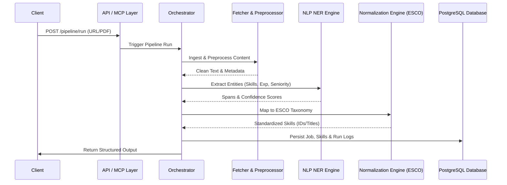
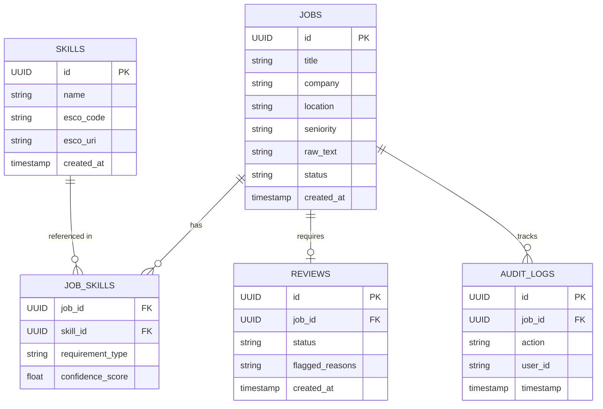

# Architecture - JD Skill Extraction Pipeline

## System Diagram
```mermaid
graph TD
    User([User / API Client]) --> APILayer[API Layer (FastAPI)]
    MCP[MCP Client] --> MCPLayer[MCP Server Layer]
    APILayer --> Orchestrator[Orchestration Layer]
    MCPLayer --> Orchestrator
    
    Orchestrator --> Ingestion[Ingestion & Fetchers]
    Orchestrator --> Preprocessing[Preprocessing Pipeline]
    Orchestrator --> NLPEngine[NLP Layer: DeBERTa NER]
    Orchestrator --> Normalizer[Skill Normalization & ESCO Mapping]
    Orchestrator --> ReviewQueue[Review Queue / State Machine]
    
    Orchestrator --> DbLayer[Persistence Layer (SQLAlchemy 2.0 / PostgreSQL)]
```

## Data Flow


## Entity Relationship (ER) Diagram

