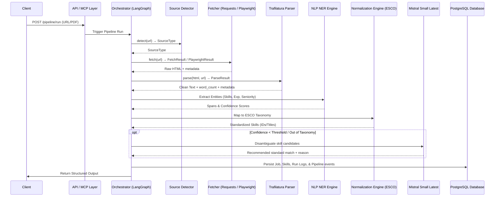
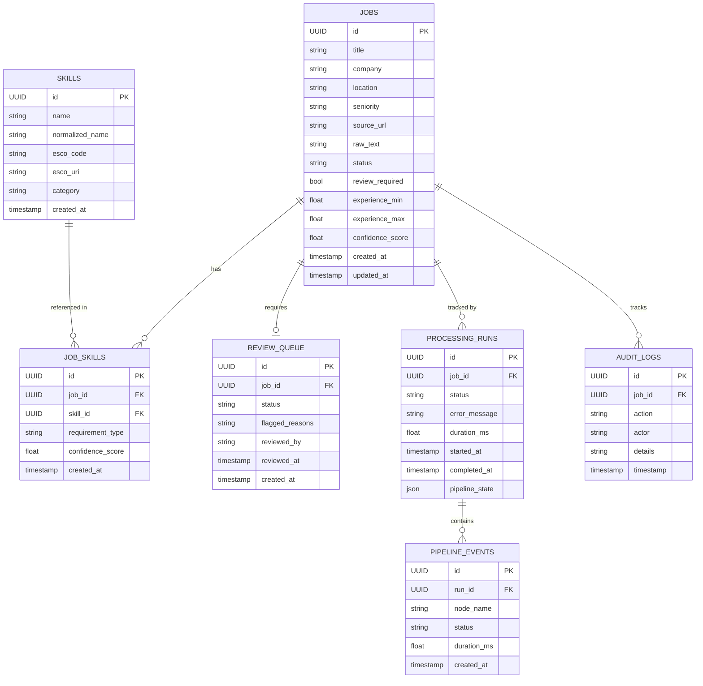
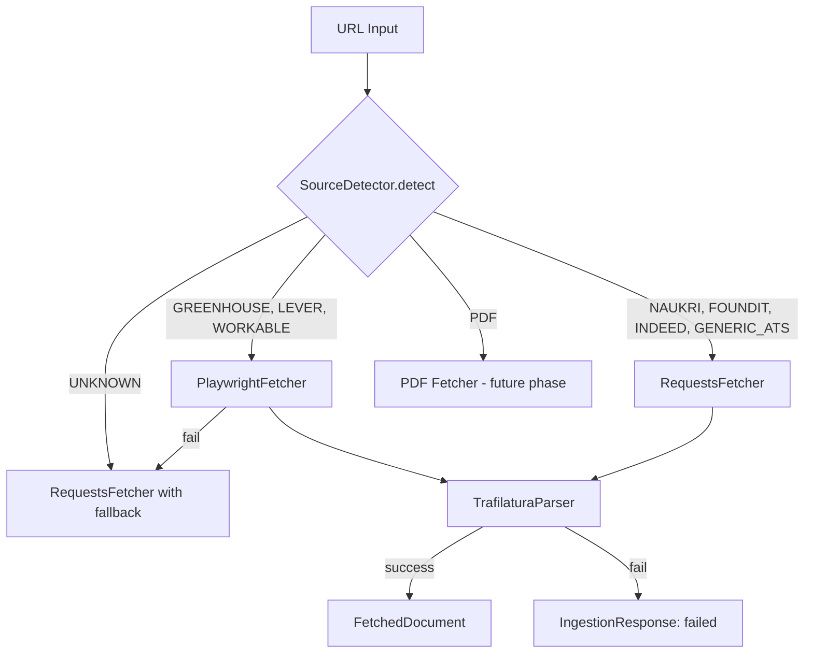
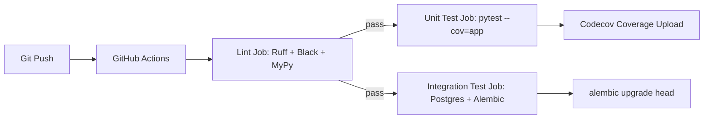

# Architecture - JD Skill Extraction Pipeline

## System Diagram
```mermaid
graph TD
    User([User / API Client]) --> APILayer[API Layer (FastAPI)]
    MCP[MCP Client] --> MCPLayer[MCP Server Layer]
    APILayer --> Orchestrator[Orchestration Layer]
    MCPLayer --> Orchestrator

    Orchestrator --> Ingestion[Ingestion & Fetchers]
    Orchestrator --> Preprocessing[Preprocessing Pipeline]
    Orchestrator --> NLPEngine[NLP Layer: DeBERTa NER]
    Orchestrator --> Normalizer[Skill Normalization & ESCO Mapping]
    Orchestrator --> ReviewQueue[Review Queue / State Machine]

    Orchestrator --> DbLayer[Persistence Layer (SQLAlchemy 2.0 / PostgreSQL)]

    subgraph Ingestion [Ingestion Framework]
        SourceDetector[Source Detector] --> FetcherRouter{Fetcher Router}
        FetcherRouter -- static page --> RequestsFetcher[Requests Fetcher]
        FetcherRouter -- JS-rendered page --> PlaywrightFetcher[Playwright Fetcher]
        RequestsFetcher --> ContentExtractor[Trafilatura Content Extractor]
        PlaywrightFetcher --> ContentExtractor
        ContentExtractor --> FetchedDocument[FetchedDocument]
    end
```

## Component Overview

### Ingestion Framework (Phase 2)
| Component | Module | Responsibility |
|-----------|--------|----------------|
| `SourceDetector` | `app.ingestion.detectors.url_detector` | Classifies JD URL → `SourceType` enum. Handles Naukri, Foundit, Indeed, Greenhouse, Lever, Workable, Generic ATS, PDF, Unknown. |
| `RequestsFetcher` | `app.ingestion.fetchers.requests_fetcher` | Static HTTP fetch with retry, UA rotation, redirect tracking, response header capture. |
| `PlaywrightFetcher` | `app.ingestion.fetchers.playwright_fetcher` | Async headless Chromium fetch for JS-rendered pages. Scroll-to-trigger, console error capture. |
| `TrafilaturaParser` | `app.ingestion.parsers.trafilatura_parser` | 3-tier HTML→text extraction: Trafilatura primary → Trafilatura broad recall → BeautifulSoup fallback. |
| Ingestion Schemas | `app.ingestion.schemas.schemas` | `SourceType`, `FetchStatus`, `DocumentMetadata`, `FetchedDocument`, `IngestionRequest`, `IngestionResponse`. |

### Preprocessing & Segmentation (Phase 3)
| Component | Module | Responsibility |
|-----------|--------|----------------|
| `TextCleaner` | `app.preprocessing.cleaners.text_cleaner` | Normalizes whitespace, unicode, collapses blank lines, unifies smart quotes, and standardizes bullets/lists while preserving indentation. |
| `HeadingNormalizer` | `app.preprocessing.normalizers.heading_normalizer` | Strips decorative punctuation and maps raw heading variants to canonical SectionTypes. |
| `BoilerplateDetector` | `app.preprocessing.classifiers.boilerplate_detector` | Scans 50+ patterns to quarantine disclaimers/marketing/EEO copy without permanent data loss. |
| `HeadingDetector` | `app.preprocessing.segmenters.heading_detector` | Detects headings using exact matches, fuzzy scoring, and structural heuristics. |
| `SectionSegmenter` | `app.preprocessing.segmenters.section_segmenter` | Splits cleaned text into raw sections at heading boundaries. |
| `SectionClassifier` | `app.preprocessing.classifiers.section_classifier` | Classifies sections using heading categories and bag-of-words keyword scoring. |
| `SegmentationService` | `app.preprocessing.services.segmentation_service` | Orchestrates the entire pipeline, records execution metadata/timing, and emits `SegmentationResult`. |

### Information Extraction Engine (Phase 4)
| Component | Module | Responsibility |
|-----------|--------|----------------|
| `SkillMention` / `ExtractionResult` | `app.extraction.schemas.schemas` | Pydantic v2 schemas for skill mentions, experience, seniority, and classifications. |
| `ModelManager` | `app.extraction.models.model_manager` | Singleton caching manager for lazy-loaded NLP/NER pipelines. |
| `DebertaLoader` | `app.extraction.models.deberta_loader` | Lazy load infrastructure for token classification model with fallback options. |
| `SkillsExtractor` | `app.extraction.skills.skills_extractor` | Dual-path skills extractor combining regex Gazetteer (high precision) with DeBERTa-v3 NER (high recall). |
| `ExperienceExtractor` | `app.extraction.experience.experience_extractor` | Regex rule engine parsing years of experience range (min, max, exact). |
| `SeniorityExtractor` | `app.extraction.seniority.seniority_extractor` | Title string scanner and experience years fallback mapping. |
| `RequirementClassifier` | `app.extraction.requirements.requirement_classifier` | Classifies requirements into Required, Preferred, or Optional. |
| `ExtractionService` | `app.extraction.services.extraction_service` | Orchestrates the extractors and runs validation checks. |

### ESCO Normalization & Taxonomy Integration (Phase 5)
| Component | Module | Responsibility |
|-----------|--------|----------------|
| `TaxonomyLoader` | `app.normalization.loaders.taxonomy_loader` | Loads local ESCO taxonomy dataset containing concepts, labels, and descriptions. |
| `TaxonomyRepository` | `app.normalization.taxonomy.taxonomy_repository` | In-memory singleton caching exact/alias indices and sentence embeddings for startup. |
| `ExactMatcher` | `app.normalization.matchers.exact_matcher` | Fast exact string matching against canonical ESCO skill names (score = 1.0). |
| `AliasMatcher` | `app.normalization.matchers.alias_matcher` | Maps common abbreviations/shorthands using target alias structures (score = 0.95). |
| `FuzzyMatcher` | `app.normalization.matchers.fuzzy_matcher` | Utilizes RapidFuzz distance search to handle typos/variations (score = 0.82-0.95). |
| `EmbeddingMatcher` | `app.normalization.matchers.embedding_matcher` | Runs sentence-transformers (all-MiniLM-L6-v2) for semantic mapping (score = 0.50-1.00). |
| `CandidateRanker` | `app.normalization.rankers.candidate_ranker` | Merges scores, handles tie resolutions, and determines top candidates. |
| `SkillNormalizationService` | `app.normalization.services.normalization_service` | Orchestrates the multi-layered match-and-rank flow to normalize raw skill texts. |

### Review System, Taxonomy Gaps & Quality Control (Phase 6)
| Component | Module | Responsibility |
|-----------|--------|----------------|
| `CustomTaxonomyLoader` | `app.normalization.loaders.custom_taxonomy_loader` | Loads custom version-controlled taxonomy JSON expansions alongside ESCO. |
| `ConfidenceEvaluator` | `app.review.evaluators.confidence_evaluator` | Evaluates matching scores against configurable thresholds to flag uncertain matches. |
| `OutOfTaxonomyDetector` | `app.review.evaluators.out_of_taxonomy` | Detects modern technical skills absent in ESCO (e.g. LangChain, CrewAI) and flags them. |
| `ReviewQueueManager` | `app.review.queues.queue_manager` | Handles persistent queue status transitions (`pending`, `in_review`, `approved`, etc.). |
| `ReviewDecisionService` | `app.review.decisions.decision_engine` | Evaluates and applies reviewer decisions (approve, reject, correct/replace). |
| `AuditTrailSystem` | `app.review.audit.audit_trail` | Writes structured audit entries tracking reviewer actions, confidence, and timestamps. |
| `ReviewService` | `app.review.services.review_service` | Orchestrates evaluate, flag, queuing, decisions, and auditing workflows. |

### LangGraph Orchestration, MCP Tools & Ollama Integration (Phase 7)
| Component | Module | Responsibility |
|-----------|--------|----------------|
| `PipelineState` | `app.orchestration.state.state` | TypedDict carrying data (job_source, raw_document, segmented_document, extraction_result, normalization_result, review_result, mistral_result, persistence_result, errors, execution_metadata, db) across nodes. |
| `JDPipelineGraph` / `workflow_graph` | `app.orchestration.graph.pipeline_graph` | Compiled LangGraph workflow orchestration fetch, segment, extract, normalize, review_eval, mistral_resolution, review_queue, and persist nodes. |
| `ReviewRouter` | `app.orchestration.routing.router` | Routing logic based on confidence evaluation: confidence >= threshold -> Persistence; confidence < threshold -> Mistral fallback. |
| `MistralClient` | `app.orchestration.mistral` | Interface to Mistral API (mistral-small-latest) with retries, timeouts, structured JSON schemas, latency, and token metrics. |
| MCP Tools | `app.orchestration.mcp` | Model Context Protocol tool framework (BaseMCPTool, ToolRegistry) exposing `fetch_jd`, `run_ner`, `lookup_taxonomy`, and `save_parsed_jd` to LLM clients. |
| `PipelineService` | `app.orchestration.services.pipeline_service` | Triggers the LangGraph pipeline execution, tracks execution metrics in PostgreSQL audit tables, and persists final PipelineState. |

### Presentation & Formatting Layer (Phase 9)
| Component | Module | Responsibility |
|-----------|--------|----------------|
| `JobIntelligenceReport` | `app.presentation.schemas.job_intelligence` | Pydantic response contract detailing job, role profile, categorized skills, education, responsibilities, and qualifications. |
| `JobIntelligenceFormatter` | `app.presentation.formatters.job_intelligence_formatter` | Formatter converting internal `PipelineState` into structured business-facing reports. |
| `ResponseBuilder` | `app.presentation.formatters.response_builder` | presentation helper class returning the formatted JSON report. |
| Debug Endpoint | `app.api.v1.endpoints.pipeline` | `GET /pipeline/debug/{job_id}` returns the full internal PipelineState. |

## Data Flow


## Entity Relationship (ER) Diagram


## Fetcher Selection Logic



## CI/CD Architecture



## Architectural Decisions

| Decision | Rationale |
|----------|-----------|
| Requests + Playwright dual-fetcher | Static pages are cheaper via Requests; JS-rendered ATS boards require Playwright. Both share the same `TrafilaturaParser`. |
| Trafilatura as primary extractor | Best-in-class HTML→text for article/job pages; configurable `MIN_EXTRACTED_SIZE` to accept short JDs. |
| BeautifulSoup last-resort fallback | Ensures _something_ is returned even from heavily obfuscated pages. |
| `FetchedDocument.to_output()` contract | Normalizes all fetcher types into a single dict shape for downstream pipeline stages. |
| SourceType enum as string enum | String values enable JSON serialization without extra transformations. |
| DeBERTa-v3 + Gazetteer dual skill extraction | Regex gazetteer catches exact tech names (e.g. C++, Python) reliably; DeBERTa identifies long-tail/contextual skills. |
| Deterministic experience & requirement classifiers | Initial rules ensure predictability and correctness before scaling up to LLMs. |
| Multi-layered skill normalization pipeline | Exact, alias, fuzzy, and semantic embedding matchers run in cascade order to balance speed, precision, and semantic recall. |
| Quality Control Review Queue & Auditing | Low-confidence mappings (<0.90) and out-of-taxonomy modern terms (e.g. LangChain) trigger human review states. Every action (approve, reject, correct) is written to a structured database audit log to prepare for future LLM integration. |
| LangGraph Workflow Orchestration | Provides robust state management, clear visual graph representation, easy conditional routing logic, and standard human-in-the-loop interfaces. |
| Mistral Small Latest Fallback | Mistral Small Latest model is dynamically executed via official API as fallback only for low confidence (<0.90) or out-of-taxonomy items, preserving API latency and cost. |
| Model Context Protocol (MCP) Bindings | Provides declarative standardized interface for LLM client integration (`fetch_jd`, `run_ner`, `lookup_taxonomy`, `save_parsed_jd`), enabling agentic tools usage. |
| Node Execution Audit Tracking | Persists diagnostic metrics (event status, duration) for each step of the pipeline execution in `pipeline_events`. |

### Next.js 15 Frontend Client (Phase 8A)
| Component | Module | Responsibility |
|-----------|--------|----------------|
| Home Workspace Portal | `frontend/src/app/page.tsx` | Arranges layout, handles responsive styling, and wires together Hero, Ingestion panel, Visualizers, and results cards. |
| Telemetry Visualizer | `frontend/src/components/PipelineVisualizer.tsx` | Renders sequentially animated workflow nodes reflecting LangGraph's processing states. |
| Results Dashboard | `frontend/src/components/ResultsDashboard.tsx` | Presents role profiles, checklist qualifications, timelines, tag clouds, Recharts graphs, copy actions, and download links. |
| Zustand State Store | `frontend/src/store/useStore.ts` | Handles active stage tracking, error catching, and local caching of the compiled report. |
| API Service Layer | `frontend/src/services/api.ts` | Integrates API endpoints `/run/url`, `/run/upload`, and `/health` with browser forms. |
