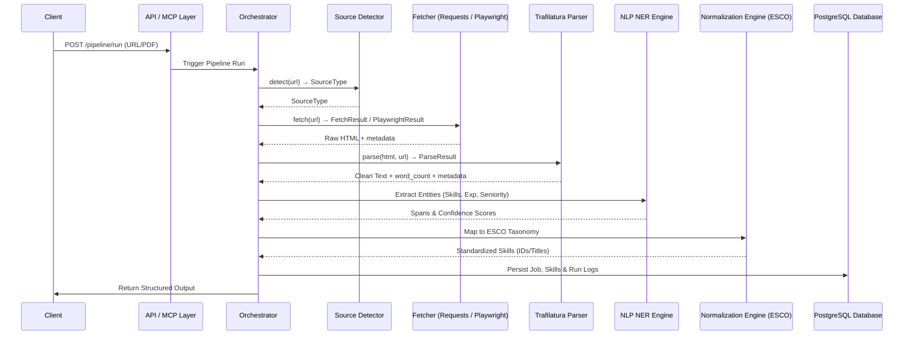
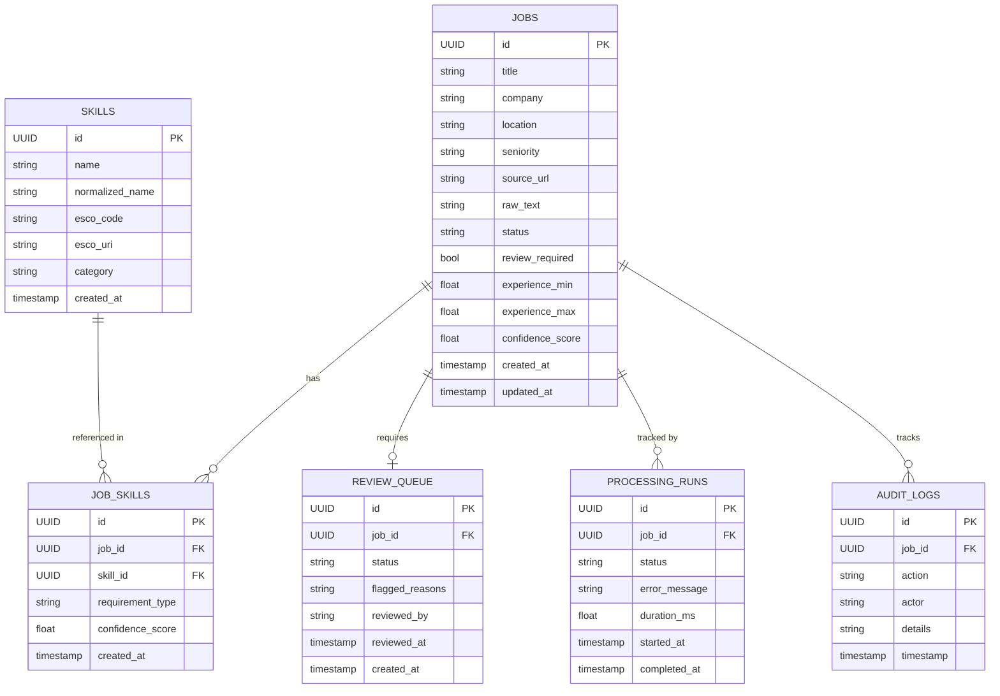
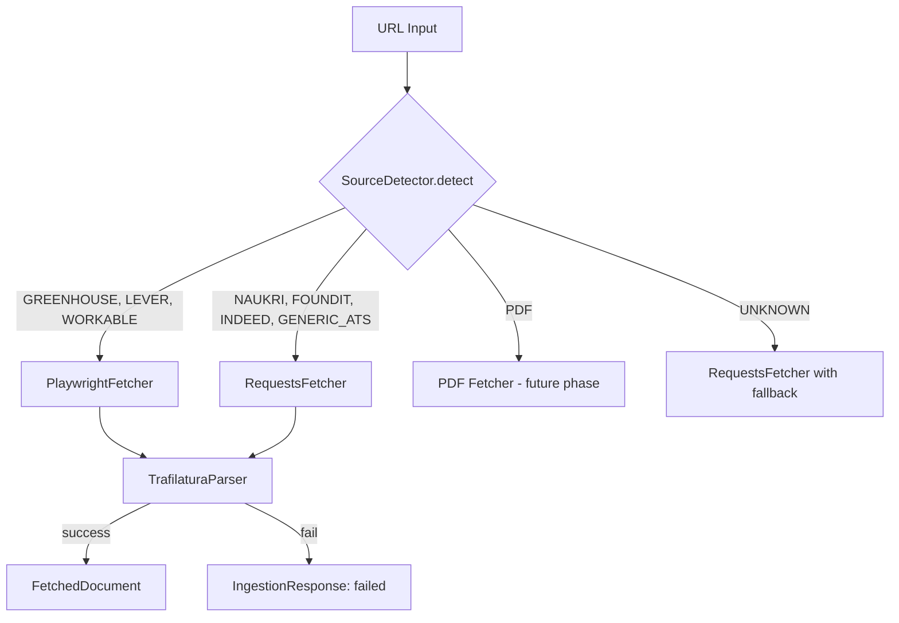
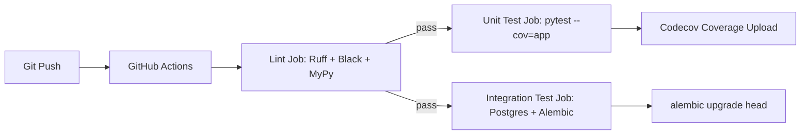

# Architecture - JD Skill Extraction Pipeline

## System Diagram
```mermaid
graph TD
    User([User / API Client]) --> APILayer[API Layer (FastAPI)]
    MCP[MCP Client] --> MCPLayer[MCP Server Layer]
    APILayer --> Orchestrator[Orchestration Layer]
    MCPLayer --> Orchestrator

    Orchestrator --> Ingestion[Ingestion & Fetchers]
    Orchestrator --> Preprocessing[Preprocessing Pipeline]
    Orchestrator --> NLPEngine[NLP Layer: DeBERTa NER]
    Orchestrator --> Normalizer[Skill Normalization & ESCO Mapping]
    Orchestrator --> ReviewQueue[Review Queue / State Machine]

    Orchestrator --> DbLayer[Persistence Layer (SQLAlchemy 2.0 / PostgreSQL)]

    subgraph Ingestion [Ingestion Framework]
        SourceDetector[Source Detector] --> FetcherRouter{Fetcher Router}
        FetcherRouter -- static page --> RequestsFetcher[Requests Fetcher]
        FetcherRouter -- JS-rendered page --> PlaywrightFetcher[Playwright Fetcher]
        RequestsFetcher --> ContentExtractor[Trafilatura Content Extractor]
        PlaywrightFetcher --> ContentExtractor
        ContentExtractor --> FetchedDocument[FetchedDocument]
    end
```

## Component Overview

### Ingestion Framework (Phase 2)
| Component | Module | Responsibility |
|-----------|--------|----------------|
| `SourceDetector` | `app.ingestion.detectors.url_detector` | Classifies JD URL → `SourceType` enum. Handles Naukri, Foundit, Indeed, Greenhouse, Lever, Workable, Generic ATS, PDF, Unknown. |
| `RequestsFetcher` | `app.ingestion.fetchers.requests_fetcher` | Static HTTP fetch with retry, UA rotation, redirect tracking, response header capture. |
| `PlaywrightFetcher` | `app.ingestion.fetchers.playwright_fetcher` | Async headless Chromium fetch for JS-rendered pages. Scroll-to-trigger, console error capture. |
| `TrafilaturaParser` | `app.ingestion.parsers.trafilatura_parser` | 3-tier HTML→text extraction: Trafilatura primary → Trafilatura broad recall → BeautifulSoup fallback. |
| Ingestion Schemas | `app.ingestion.schemas.schemas` | `SourceType`, `FetchStatus`, `DocumentMetadata`, `FetchedDocument`, `IngestionRequest`, `IngestionResponse`. |

### Preprocessing & Segmentation (Phase 3)
| Component | Module | Responsibility |
|-----------|--------|----------------|
| `TextCleaner` | `app.preprocessing.cleaners.text_cleaner` | Normalizes whitespace, unicode, collapses blank lines, unifies smart quotes, and standardizes bullets/lists while preserving indentation. |
| `HeadingNormalizer` | `app.preprocessing.normalizers.heading_normalizer` | Strips decorative punctuation and maps raw heading variants to canonical SectionTypes. |
| `BoilerplateDetector` | `app.preprocessing.classifiers.boilerplate_detector` | Scans 50+ patterns to quarantine disclaimers/marketing/EEO copy without permanent data loss. |
| `HeadingDetector` | `app.preprocessing.segmenters.heading_detector` | Detects headings using exact matches, fuzzy scoring, and structural heuristics. |
| `SectionSegmenter` | `app.preprocessing.segmenters.section_segmenter` | Splits cleaned text into raw sections at heading boundaries. |
| `SectionClassifier` | `app.preprocessing.classifiers.section_classifier` | Classifies sections using heading categories and bag-of-words keyword scoring. |
| `SegmentationService` | `app.preprocessing.services.segmentation_service` | Orchestrates the entire pipeline, records execution metadata/timing, and emits `SegmentationResult`. |

## Data Flow


## Entity Relationship (ER) Diagram


## Fetcher Selection Logic



## CI/CD Architecture



## Architectural Decisions

| Decision | Rationale |
|----------|-----------|
| Requests + Playwright dual-fetcher | Static pages are cheaper via Requests; JS-rendered ATS boards require Playwright. Both share the same `TrafilaturaParser`. |
| Trafilatura as primary extractor | Best-in-class HTML→text for article/job pages; configurable `MIN_EXTRACTED_SIZE` to accept short JDs. |
| BeautifulSoup last-resort fallback | Ensures _something_ is returned even from heavily obfuscated pages. |
| `FetchedDocument.to_output()` contract | Normalizes all fetcher types into a single dict shape for downstream pipeline stages. |
| SourceType enum as string enum | String values enable JSON serialization without extra transformations. |
