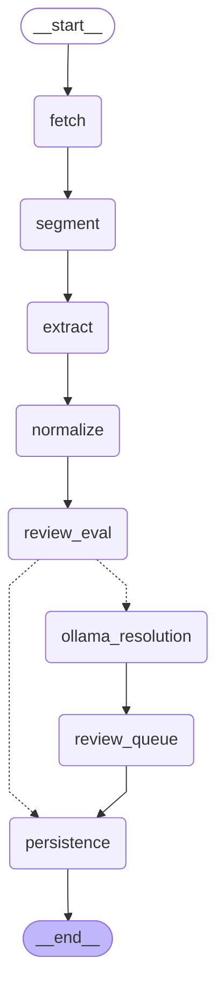

# Pipeline Flow Graph

```mermaid
---
config:
  flowchart:
    curve: linear
---
graph TD;
	__start__([<p>__start__</p>]):::first
	fetch(fetch)
	segment(segment)
	extract(extract)
	normalize(normalize)
	review_eval(review_eval)
	ollama_resolution(ollama_resolution)
	review_queue(review_queue)
	persistence(persistence)
	__end__([<p>__end__</p>]):::last
	__start__ --> fetch;
	extract --> normalize;
	fetch --> segment;
	normalize --> review_eval;
	ollama_resolution --> review_queue;
	review_eval -.-> ollama_resolution;
	review_eval -.-> persistence;
	review_queue --> persistence;
	segment --> extract;
	persistence --> __end__;
	classDef default fill:#f2f0ff,line-height:1.2
	classDef first fill-opacity:0
	classDef last fill:#bfb6fc

```
